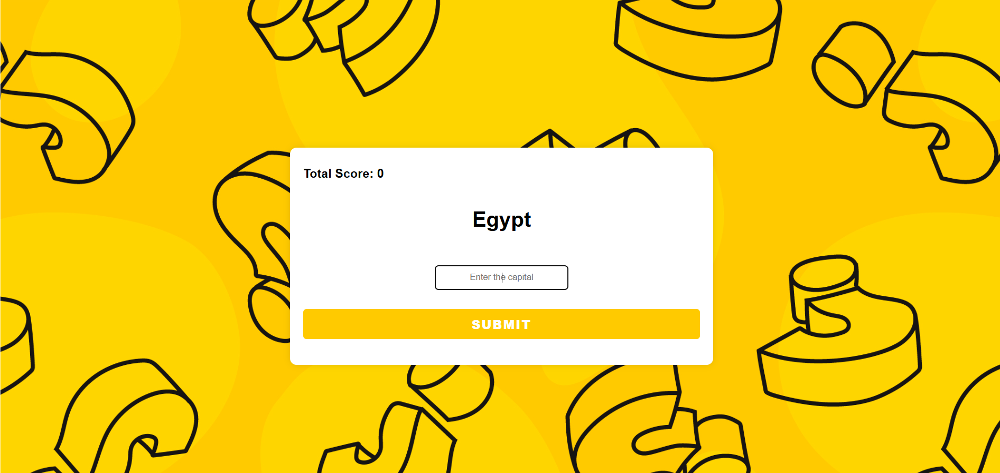

# Capital City Quiz

Este é um jogo interativo para testar seus conhecimentos sobre capitais de países, desenvolvido com Node.js, Express e PostgreSQL.

## 📚 O que aprendi
- Como conectar um banco de dados PostgreSQL a uma aplicação Node.js.
- Como lidar com rotas e middleware no Express.
- Como renderizar páginas dinâmicas usando EJS.

## 🚀 Tecnologias Utilizadas
- Node.js
- Express.js
- PostgreSQL
- EJS
- Body-parser

## ⚙️ Funcionalidades
- Apresenta um país aleatório ao usuário.
- O usuário deve digitar a capital correta.
- O jogo mantém a pontuação correta até que o usuário erre.
- Após um erro, exibe a pontuação final e oferece a opção de reiniciar.
